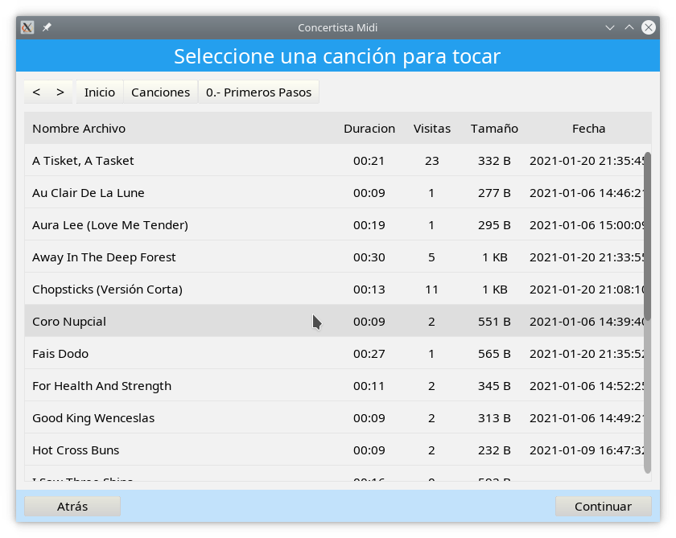

# Concertista MIDI

Concertista MIDI es un juego para aprender a tocar piano facilmente usando el teclado o el ratón de tu computador (Tambien deberia funciona con un teclado MIDI pero no ha sido probado), Concertista MIDI utiliza la libreria midi ([libmidi](https://github.com/linthesia/linthesia/tree/master/src/libmidi)) de linthesia para reproducir archivos y dispositivos MIDI pero incluye varias mejoras como:

* Pistas independientes para archivos MIDI formato 0
* Se implemento el evento MidiMetaEvent_TimeSignature para representar correctamente canciones en compas distinto de 4/4
* El texto de los archivos midi es leido con la codificación **windows-1252** para poder representar correctamente caracteres del español como eñes y acentos
* Varias correcciones de errores.

### Caracteristicas
* Selector de archivos
	* Navegación a traves de las carpetas configuradas
* Selector de pistas
	* Modo de juego
		* Fondo: Reproduce de forma automatica
		* Tocar: Tocado por el jugador
		* Aprender: Espera a que el jugador toque la nota correcta
	* Color de pista con 9 colores diferentes
	* Sonido
* Teclado midi completo de 128 teclas
	* Teclado de 37, 49, 61, 76, 88 teclas
	* Teclado personalisable
* Entrada desde teclado y raton
* Musica de entrenamiento ([de linthesia](https://github.com/linthesia/linthesia/tree/master/music/Learning))
* Reproduccion de karaoke (.kar)
* Configuración
	* Carpetas MIDI personalizadas
	* Dispositivos de entrada/salida

### Capturas

-----------

### Atajos de Teclado

|Tecla                 | Función                                                 |
|:---------------------|:--------------------------------------------------------|
|F4                    |Mostrar y ocultar Subtitulos                             |
|F5                    |Teclado de 37 teclas                                     |
|F6                    |Teclado de 49 teclas                                     |
|F7                    |Teclado de 61 teclas                                     |
|F8                    |Teclado de 76 teclas                                     |
|F9                    |Teclado de 88 teclas                                     |
|F10                   |Modo Desarrollo                                          |
|F11                   |Pantalla Completa                                        |
|F12                   |Modo Alambre                                             |
|Flecha Arriba         |Encoger notas, Subir en el navegador de archivos         |
|Flecha Abajo          |Estirar notas, Bajar en el navegador de archivos         |
|Flecha Izquierda      |Reducir velocidad, Atras en el navegador de archivos     |
|Flecha Derecha        |Aumentar velocidad, Adelante en el navegador de archivos |
|Insertar              |Desplazar Organo a la Derecha                            |
|Suprimir              |Desplazar Organo a la Izquierda                          |
|Re Pág                |Agregar una tecla al organo                              |
|Av Pág                |Eliminar una tecla al organo                             |
|Espacio               |Pausar                                                   |
|Escape                |Atras o Salir                                            |
|Enter                 |Entrar o Continuar                                       |
|Numeros al Borrar     |Teclas negras                                            |
|Tabulador al Enter    |Teclas blancas en el organos                             |

## Requerimientos

Se requieren los siguientes paquetes para compilar concertista midi.

|Libreria    | Uso                                   |
|:-----------|:--------------------------------------|
|cmake       |Construccion                           |
|pkg-config  |Busqueda de bibliotecas                |
|g++         |Compilación                            |
|glew        |Opengl                                 |
|libsdl2     |Sdl2 para OpenGl                       |
|glm         |Libreria de matematica para opengl     |
|freetype    |Tipografias                            |
|icu         |String Unicode                         |
|sqlite      |Base de datos                          |

### Instalar paquetes en Ubuntu

	sudo apt install cmake pkg-config libglew-dev libsdl2-dev libglm-dev libfreetype6-dev libicu-dev libsqlite3-dev

### Instalar paquetes en Gentoo

	emerge --ask media-libs/glew media-libs/libsdl2 media-libs/glm media-libs/freetype dev-libs/icu dev-db/sqlite

-----------------

## Compilación

	mkdir binario
	cd binario
	cmake ..
	make

--------------

## Ejecutar

Ya es posible ejecutar concertista midi con:

	./concertistamidi

pero si tu computador no tiene una tarjeta de sonido con un sintetizador midi incluido (que es lo mas probable) no escucharas nada, para reproducir sonido es necesario instalar un sintetizador midi, hay varios disponibles para linux como timidity y musescore.

### Instalar Timidity en Ubuntu

	sudo apt install timidity

### Instalar Timidity en Gentoo

	emerge --ask media-sound/timidity++ media-sound/fluid-soundfont
	nano /etc/timidity.cfg

Agrega lo siguiente:

	dir /usr/share/sounds/sf2
	soundfont FluidR3_GM.sf2

### Ejecutar Timidity
Ejecuta el siguiente comando y no cierres el terminal.

	timidity -iA -B2,8 -Os1l -s 44100

Ahora se puede ejecutar concertista midi, debes asegurarte que en la configuracion de Concertista MIDI este seleccionado el dispositivo de salida correcto en este caso **TiMidity port 0**.

Para la entrada puedes configurar el Teclado y Raton para tocar, tambien deberia ser posible conectar un teclado MIDI pero no ha sido probado.

-----------

## Licencia

Este proyecto esta diponible bajo la licencia GNU General Public License v2.0

-----------
